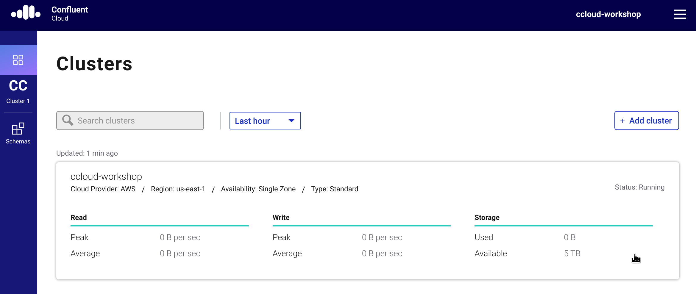
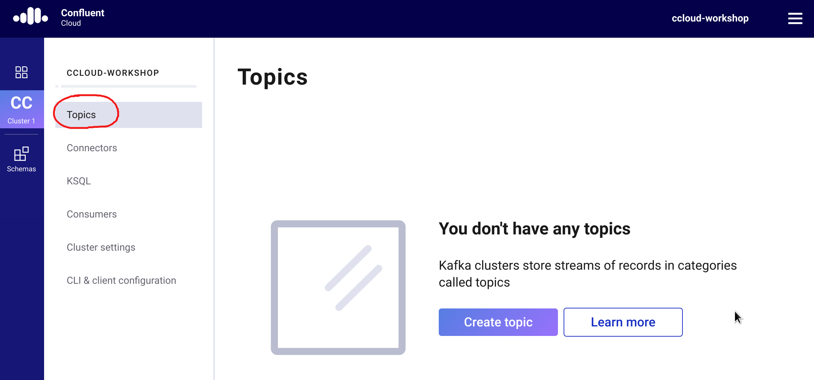
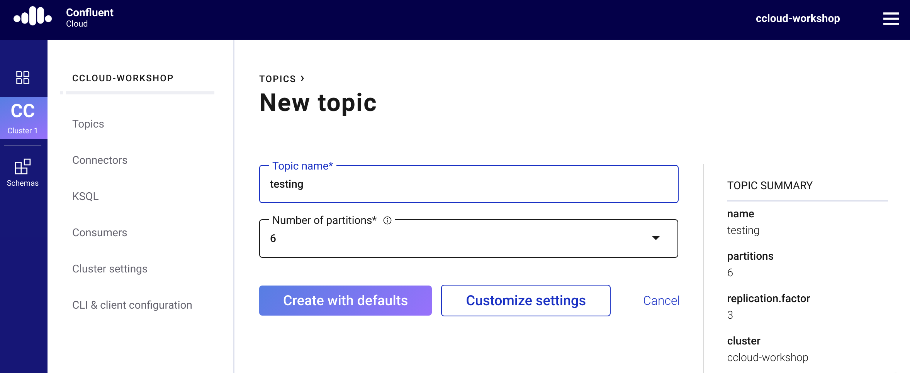
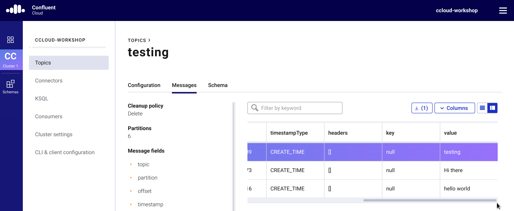
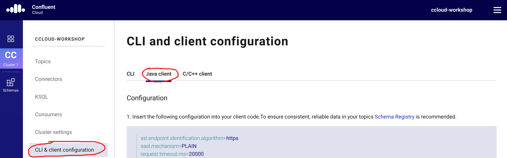
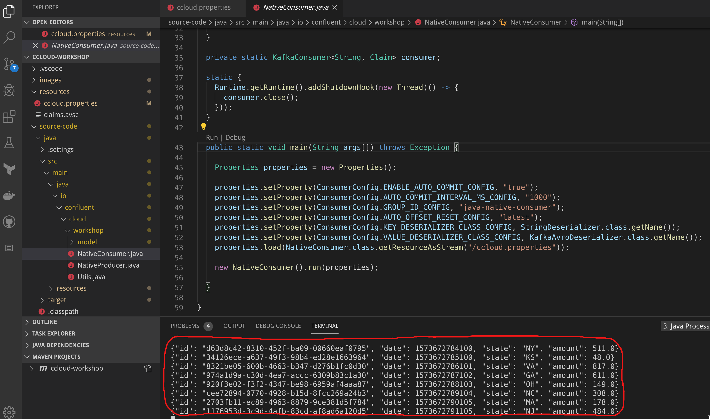

# Confluent Cloud Workshop
This workshop has been created to get developers up-to-speed in how to implement Apache Kafka based applications using [Confluent Cloud](https://www.confluent.io/confluent-cloud). This workshop doesn't intend to teach the basis of Apache Kafka, therefore developers participating of this workshop should have previous familiarity with Kafka.

## Requirements

- Active account in Confluent Cloud.
- Software VirtualBox installed: https://www.virtualbox.org/wiki/Downloads
- VM containing the environment. Click [here](https://riferrei-sharing.s3-accelerate.amazonaws.com/confluent-workshop.zip) to download the latest version of the VM.
- Access to the internet (Download, Read)
- Access to endpoints over the port 9092

## Overview

In this workshop we are going to create an end-to-end application that processes claim data. It will be shown different methods of how to handle that data, including the Confluent Cloud CLI, native producers and consumers written in Java, as well as an KSQL pipeline that will transform and aggregate the data. It will be also shown how to handle data using the Avro format, where it is going to be possible to leverage the native features in Confluent Cloud for schema enforcement. Finally, we will export the processed data to a bucket in AWS S3 -- by using a managed connector available in Confluent Cloud.

## Exercise 01: Setting Up the Environment and Creating a Cluster

In this exercise, you will be setting up a new environment in Confluent Cloud, where you will create a new cluster and also set up a managed Schema Registry for it. This environment will be used throughout the entire workshop. The estimated time to complete this exercise is of **15 minutes**.

- **Step 01**: Log in into [Confluent Cloud](https://confluent.cloud/login) using your credentials.
  
- **Step 02**: Click on the *Add Environment* button to create a new environment.
- **Step 03**: Enter with a name for the environment. Type "confluent-workshop" and the click in the *Create* button.
  
- **Step 04**: Click in the *Create Cluster* button to create a new cluster.
- **Step 05**: In the field *Cluster Name* type "confluent-workshop".
- **Step 06**: In the field *Provider* select "Amazon Web Services".
- **Step 07**: In the field *Region* select "us-east-1".
- **Step 08**: In the field *Availability* select "Single Zone".
- **Step 09**: Click in the *Continue* button to confirm the cluster creation.
  
- **Step 10**: In the *Review and Launch* dialog, click in the *Launch* button to create the cluster.
- **Step 11**: Click on the *Schemas* tab to access the managed Schema Registry configuration.
  
- **Step 12**: In the field *Cloud Provider* select "Amazon Web Services".
- **Step 13**: In the field *Region* select "US".
- **Step 14**: Click on the *Enable Schema Registry* to confirm the Schema Registry creation.
  
- **Step 15**: In the *Enable Schema Registry* dialog, click in the *Confirm* button to enable Schema Registry.

By completing this exercise, you should have:

- One environment named "confluent-workshop".
- One cluster named "confluent-workshop".
- Schema Registry enabled for the environment.

## Exercise 02: Creating a Topic and Writing Data on It

In this exercise, you will create a topic in the cluster and use the Confluent Cloud CLI to write data on it. This exercise will help you understand the concept of authentication using API Keys, as well as some of the basic functionality found in both the UI and the CLI. The estimated time to complete this exercise is of **30 minutes**.

- **Step 01**: Log in into [Confluent Cloud](https://confluent.cloud/login) using your credentials.
  
- **Step 02**: Select the environment "confluent-workshop" to access the environment.
- **Step 03**: Click in the cluster "confluent-workshop" to access the cluster.
  
- **Step 04**: Click on the tab *Topics* to access the topic management.
  
- **Step 05**: Click in the *Create Topic* button to create a new topic.
- **Step 06**: In the field *Topic Name* type "testing".
- **Step 07**: Click in the *Create with Defaults* button to confirm the topic creation.
  
- **Step 08**: Click on the tab *Messages* to access the built-in consumer.
  
- **Step 09**: Open a new terminal in your Linux desktop.
- **Step 10**: Log in to Confluent Cloud by typing:
  ```bash
  ccloud login
  ```
- **Step 11**: List your environments by typing:
  ```bash
  ccloud environment list
  ```
- **Step 12**: Select the ID of the environment "confluent-workshop".
- **Step 13**: Make sure the environment is selected by typing:
  ```bash
  ccloud environment use <ID_SELECTED_ON_STEP_12>
  ```
- **Step 14**: List your clusters by typing:
  ```bash
  ccloud kafka cluster list
  ```
- **Step 15**: Select the ID of the cluster "confluent-workshop".
- **Step 16**: Make sure the cluster is selected by typing:
  ```bash
  ccloud kafka cluster use <ID_SELECTED_ON_STEP_15>
  ```
- **Step 17**: List your topics by typing:
  ```bash
  ccloud kafka topic list
  ```
- **Step 18**: Describe the topic "testing" by typing:
  ```bash
  ccloud kafka topic describe testing
  ```
- **Step 19**: Create a new API Key by typing:
  ```bash
  ccloud api-key create
  ```
- **Step 20**: Select the API Key shown in the console.
- **Step 21**: Make sure the API Key is selected by typing:
  ```bash
  ccloud api-key use <API_KEY_SELECTED_ON_STEP_20>
  ```
- **Step 22**: Create a built-in producer by typing:
  ```bash
  ccloud kafka topic produce testing
  ```
- **Step 23**: Type random strings (ex: 'hello world', 'Hi there', 'testing') and press enter for each one of them.
- **Step 24**: Press 'Ctrl + C' to stop the built-in producer.
- **Step 25**: Go back to the Confluent Cloud UI to check if the records were written in the topic.
  
- **Step 26**: To check if the records were written using the console, type:
  ```bash
  ccloud kafka topic consume testing -b
  ```
- **Step 27**: Log out from the CLI by typing:
  ```bash
  ccloud logout
  ```

By completing this exercise, you should have:

- One topic named "testing".
- Some records stored in this topic.

## Exercise 03: Producing and Consuming Claims using Java

In this exercise, you will clone this repository to use the source-code written in Java to interact with your cluster. The code contains examples of native Java applications that relies on Kafka's client API to produce and consume records. The records created in this exercise will be used later on the workshop. The estimated time to complete this exercise is of **45 minutes**.

- **Step 01**: Log in into [Confluent Cloud](https://confluent.cloud/login) using your credentials.
  
- **Step 02**: Select the environment "confluent-workshop" to access the environment.
- **Step 03**: Click in the cluster "confluent-workshop" to access the cluster.
  
- **Step 04**: Click on the tab *CLI and Client Configuration* to access the client management.
- **Step 05**: Click on the tab *Java Client* to access the Java client management.
  
- **Step 06**: Click in the *Create Kafka Cluster API Key & Secret* button to create an API Key for the cluster.
- **Step 07**: In the *Create an API Key* dialog, select the checkbox and then click in the *Continue* button.
- **Step 08**: Click in the *Create Schema Registry API Key & Secret* button to create an API Key for Schema Registry.
- **Step 09**: In the *Create a New Schema Registry API Key* dialog, select the checkbox and then click in the *Continue* button.
- **Step 10**: Click in the *Copy to Clipboard* button to copy the properties created to the clipboard.
- **Step 11**: Open the Visual Studio Code IDE in the desktop.
- **Step 12**: Within the ccloud-workshop project, expand the folder *resources*.
- **Step 13**: Click on the file *ccloud.properties* to open in the editor.
- **Step 14**: Remove all the content that the file *ccloud.properties* might have.
- **Step 15**: Press 'Ctrl + V' to paste the properties that you copied on step 10.
- **Step 16**: Save the changes made in the file *ccloud.properies*.
- **Step 17**: Right click the option *ccloud-workshop* under the Maven projects view and select 'clean'.
  
- **Step 18**: Right click the option *ccloud-workshop* under the Maven projects view and select 'compile'.
- **Step 19**: Right click the option *ccloud-workshop* under the Maven projects view and select 'package'.
- **Step 20**: Within the ccloud-workshop project, expand the folder *source-code*.
- **Step 21**: Within the *source-code* folder, expand: java/src/main/java/io/confluent/cloud/workshop.
- **Step 22**: Click on the file *NativeProducer.java* to open in the editor.
- **Step 23**: Scrow down the source-code until you find the main method.
- **Step 24**: Click on the option *Run* to execute this Java class.
  
  * Don't bother if Visual Studio Code says that there are compiler errors. There aren't, so just click *Proceed*.
- **Step 25**: In should see under the terminal, the output of the Java class saying that claims are being created.
  
  * Please leave this Java application running until the end of the workshop.
- **Step 26**: If you inspect the topics on the cluster, you should see a new topic called 'claims' and some messages being written on it.
  
- **Step 27**: Within the *source-code* folder, expand: java/src/main/java/io/confluent/cloud/workshop.
- **Step 28**: Click on the file *NativeConsumer.java* to open in the editor.
- **Step 29**: Scrow down the source-code until you find the main method.
- **Step 30**: Click on the option *Run* to execute this Java class.
  
  * Don't bother if Visual Studio Code says that there are compiler errors. There aren't, so just click *Proceed*.
- **Step 31**: In should see under the terminal, the output of the Java class saying that claims are being consumed.
  

By completing this exercise, you should have:

- One new topic named "claims".
- Some records stored in this topic.

## Exercise 04: Building an Event Streaming Pipeline using KSQL

In this exercise, you are going to build an event streaming pipeline that will transform the raw events containing the claims into a table that summarizes the sum of all claims per state, as well as change the output format from Avro to JSON. In order to do this, you are going to spin up your own KSQL Server that will connect to the cluster running on Confluent Cloud. The estimated time to complete this exercise is of **30 minutes**.

- **Step 01**: Open the Visual Studio Code IDE in the desktop.
- **Step 02**: Within the ccloud-workshop project, expand the folder *resources*.
- **Step 03**: Click on the file *ccloud.properties* to open in the editor.
- **Step 04**: Within the ccloud-workshop project, expand the folder *source-code*.
- **Step 05**: Within the *source-code* folder, expand: ksql.
- **Step 06**: Click on the file *ksql-server.properties* to open in the editor.
- **Step 07**: In the *ksql-server.properties* file, replace all the variables with the values present in the file *ccloud.properties*. The variables you need to replace are:
  * <BOOTSTRAP_SERVERS>
  * <CLUSTER_API_KEY>
  * <CLUSTER_API_SECRET>
  * <SCHEMA_REGISTRY_URL>
  * <SR_API_KEY>:<SR_API_SECRET>
- **Step 08**: Save the changes made in the file *ksql-server.properies*.
- **Step 09**: Open a new terminal, and navigate to the folder that contains the file *ksql-server.properties*.
- **Step 10**: Run your own KSQL Server by typing:
  ```bash
  ksql-server-start ksql-server.properties
  ```
- **Step 11**: You should see something like the image below:
  
  * Please leave this KSQL Server running until the end of the workshop.
- **Step 13**: Within the *source-code* folder, expand: ksql.
- **Step 14**: Click on the file *pipeline.sql* to open in the editor.
- **Step 15**: Replace the variable <YOUR_NAME> with your name.
- **Step 16**: Save the changes made in the file *pipeline.sql*.
- **Step 17**: Open a new terminal, and navigate to the folder that contains the file *pipeline.sql*.
- **Step 18**: Start a new client session with the KSQL Server by typing:
  ```bash
  ksql
  ```
- **Step 19**: Once you are logged into the KSQL Server, type:
  ```bash
  RUN SCRIPT 'pipeline.sql';
  ```
- **Step 20**: To make sure everything is correct, type:
  ```bash
  SELECT * FROM CLAIMS_PER_STATE;
  ```
- **Step 21**: You should see an output like the one below:
  

By completing this exercise, you should have:

- A KSQL Server instance running forever.
- An event streaming pipeline created.
- One new topic named "CLAIMS_REKEYED".
- Some records stored in this topic.
- One new topic named "<YOUR_NAME>_STREAM".
- Some records stored in this topic.
- One new topic named "CLAIMS_PER_STATE".
- Some records stored in this topic.

## License

[Apache 2.0 License](./LICENSE).