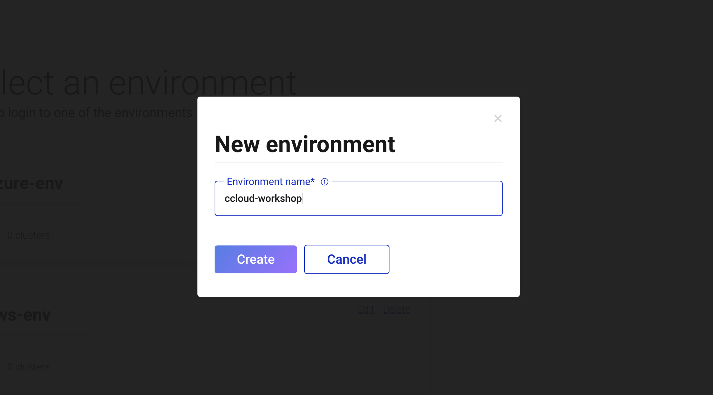
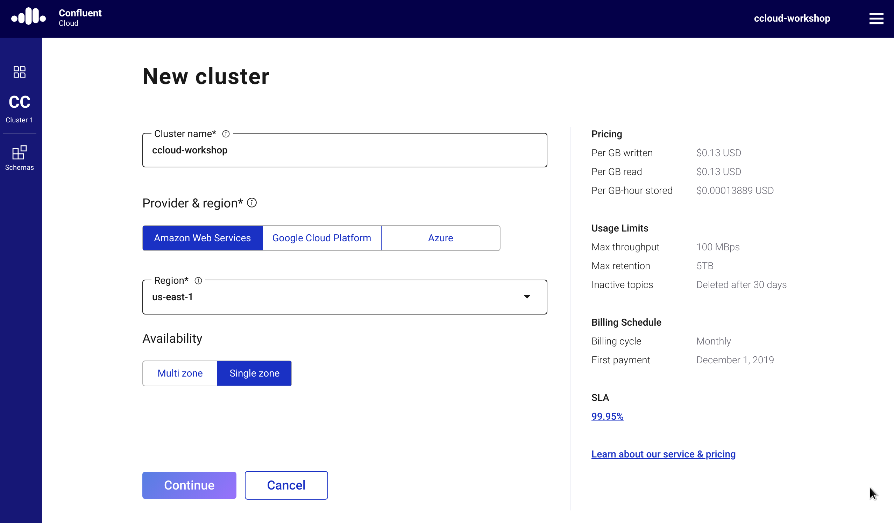

# Confluent Cloud Workshop
This workshop has been created to get developers up-to-speed in how to implement Apache Kafka based applications using [Confluent Cloud](https://www.confluent.io/confluent-cloud). This workshop doesn't intend to teach the basis of Apache Kafka, therefore developers participating of this workshop should have previous familiarity with Kafka.

## Requirements

- Active account in Confluent Cloud.
- Software VirtualBox installed: https://www.virtualbox.org/wiki/Downloads
- VM containing the environment. Click [here](https://riferrei-sharing.s3-accelerate.amazonaws.com/confluent-workshop.zip) to download the latest version of the VM.
- Access to the internet (Download, Read)
- Access to endpoints over the port 9092

## Overview

In this workshop we are going to create an end-to-end application that processes claim data. It will be shown different methods of how to handle that data, including the Confluent Cloud CLI, native producers and consumers written in Java, as well as an KSQL pipeline that will transform and aggregate the data. It will be also shown how to handle data using the Avro format, where it is going to be possible to leverage the native features in Confluent Cloud for schema enforcement. Finally, we will export the processed data to a bucket in AWS S3 -- by using a managed connector available in Confluent Cloud.

## Exercise 01: Setting Up the Environment and Creating a Cluster

In this exercise, you will be setting up a new environment in Confluent Cloud, where you will create a new cluster and also set up a managed Schema Registry for it. This environment will be used throughout the entire workshop. The estimated time to complete this exercise is of **5 minutes**.

- **Step 01**: Log in into [Confluent Cloud](https://confluent.cloud/login) using your credentials.
  
- **Step 02**: Click on the *Add Environment* button to create a new environment.
- **Step 03**: Enter with a name for the environment. Type "confluent-workshop" and the click in the *Create* button.
  
- **Step 04**: Click in the *Create Cluster* button to create a new cluster.
- **Step 05**: In the field *Cluster Name* type "confluent-workshop".
- **Step 06**: In the field *Provider* select "Amazon Web Services".
- **Step 07**: In the field *Region* select "us-east-1".
- **Step 08**: In the field *Availability* select "Single Zone".
- **Step 09**: Click in the *Continue* button to confirm the cluster creation.
  
- **Step 10**: In the *Review and Launch* dialog, click in the *Launch* button to create the cluster.
- **Step 11**: Click on the *Schemas* tab to access the managed Schema Registry configuration.
  
- **Step 12**: In the field *Cloud Provider* select "Amazon Web Services".
- **Step 13**: In the field *Region* select "US".
- **Step 14**: Click on the *Enable Schema Registry* to confirm the Schema Registry creation.
  
- **Step 15**: In the *Enable Schema Registry* dialog, click in the *Confirm* button to enable Schema Registry.

By completing this exercise, you should have:

- One environment named "confluent-workshop".
- One cluster named "confluent-workshop".
- Schema Registry enabled for the environment.

```java
bootstrap.servers=localhost:9092
listeners=http://localhost:8088
auto.offset.reset=earliest

############################## Jaeger Tracing Configuration ################################

producer.interceptor.classes=io.confluent.devx.util.KafkaTracingProducerInterceptor
consumer.interceptor.classes=io.confluent.devx.util.KafkaTracingConsumerInterceptor

############################################################################################
```

```bash
export INTERCEPTORS_CONFIG_FILE=/etc/jaeger/ext/interceptorsConfig.json
```

Here is an example of the JSON configuration file:

```json
{
   "services":[
      {
         "service":"CustomerService",
         "config":{
            "sampler":{
               "type":"const",
               "param":1
            },
            "reporter":{
               "logSpans":true,
               "flushIntervalMs":1000,
```xml
<dependency>
    <groupId>io.opentracing</groupId>
    <artifactId>opentracing-api</artifactId>
    <version>VERSION</version>
</dependency>

</dependency>
```

## License

[Apache 2.0 License](./LICENSE).